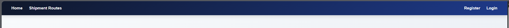
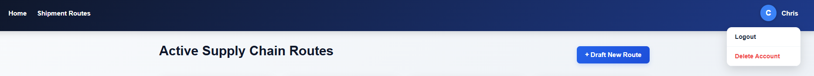

# CARBON OFFSET & TARIFF ESTIMATOR

An Application built to help e-commerce businesses to calculate supply chain emissions and projected Carbon Border Adjustment Mechanism (CBAM) tariffs.

<!-- short explanation of these terms -->
<details>
    <summary>What is Carbon Border Adjust Mechnanism (CBAM) tariff? What's its significance?</summary>

    - Introduced by European Union(EU) and other countries (eg. Australia, UK, Canada, Turkey, USA) also exploring the options.
    - Based on greenhouse gas emissions generated during the production of certain imported goods, A Carbon price is fixed.
    - GOAL :
        - Eradicate "CARBON LEAKAGE"
        - i.e. when companies(due to EU have stronger climate regulations) move productions to countries with weaker climate regulations and then import the products into the EU.
        - This causes climate depreciation in those countries.

    For further understanding, checkout:
- [What is a Carbon Border Adjustment Mechanism? (Brookings)](https://www.brookings.edu/articles/what-is-a-carbon-border-adjustment-mechanism/)
</details>

<!-- Global Tech stack used -->
## 🛠️ Tools Used : 
- React-js 
- Vite
- React-Router
- Axios Library
- JSON-server
- JSX
- JS-ES6+
- CSS (flex, grid).


<!-- Phase 1-->
## Phase 1 : Project, React Router, JSON-server, Axios instance setup & Data Fetching from JSON-server and rendered the data.

- 🔍 Concepts Used :
    - psuedo-backend REST-API setup using JSON-server.
        ran backend using:
    ```bash
        json-server --watch db.json --port port_num
    ```
    -  Configured an Axios instance to avoid more lines of code for API calls.
    ```javascript
    const api = axios.create({
        baseURL: "your_local_url"
    });

    ```
    - Enabled Routing using `react-router-dom` and defined the routes using `<Route>` and navigation using `<Link>`.
    ```javascript
    <Routes>
    <!-- also used :id dynamic paramter for dynamic routing based on ID-->
        <Route path="/shipments/:id" element={<ShipmentDetails />} />
    </Routes>

    <!-- for actual navigation -->
    <Link to="/">Home</Link>
    ```

    - `useState()` to store fetched data, `useEffect()` for side effects (here) API GET call,`async-await` and `try-catch` also used for API GET call, `map()` to dynamically render multiple `<RouteCard/>`
    ```javascript
      useEffect(() => {
        getRoutes();
      }, []);

    // used the centralized axios for simpler API calls inside try-catch
    try{
    const response = await api.get("/routes");
        // store fetched data inside `state`
    }
    catch(error)
    {
        //define what to do if API Get fails
    }

    // map() to render multiple cards
    {routes.map((route) => (
          <RouteCard key={route.id} route={route} />
        ))}

    // props to pass data from parent to child component and destructuring to extract values from objects.
    function RouteCard({ route }){
        // fn
    }

    // useParams() to extract dynamic parameter : id for dynamic routing to specific pages/components
      const { id } = useParams();
    ```
    ### Phase 1.5 : Landing/Home Page Modification
    - Added 3 sections to Home page, using `Semantic Tags`.
    - used action `scrollIntoView` on Call To Action(CTA) button `onClick` event.
    
## Phase 2 : Working with forms, State management & CRUD(Create,Read,Delete,Update) Operations.

- 🔍 Concepts Used : 
    - created n used Controlled Form Components using `useState()` hook and `...data` : `spread operator`
    ```javascript
    // state to hold data typed by user
    const [formData, setFormData] = useState({
        // initialize formData
    });

   setFormData({
        // Keep all existing data : spread operator for DEEP COPY
      ...formData, 
      // Update only the field that was changed
      [event.target.name]: event.target.value 
    });
    ```
    - Events used : `onClick`, `onSubmit`, `onChange`
    - `useNavigate` hook for navigation controlled by code not user. 
    ```javascript
    // destructure for using useNavigate() hook
    const navigate = useNavigate();
    // as soon as POST request sent automatically navigate back to Shipments page
    navigate("/shipments");
    ```
    - To prevent automatic Form reload `onSubmit`
    ```javascript
        event.preventDefault(); 
    ```
    - used and applied CRUD Lifestyle : 
        - `C`reate via `POST` request
        - `R`ead via `GET` request
        - `U`pdate via `PUT` request
        - `D`elete via `DELETE` request
    - optimized UI re-rendering using `array.filter()` in place of expensive `server re-fetch`.
    - Built UX "Escape Latches" to allow users to exit forms easily using `<Link>`.
    - Used simple `Geopoltical Emission & Tariff Algorithms` to calculate the `tariff`.
### Phase Issue 2.1 : Handling `` failing to render image.
- 2 layered fallback strategy :
    - Strategy 1 :
        - `onError` Event inside `` that defines action if image fails to load, where `src` attribute swaps image with more reliable default image.
    - Strategy 2 :
        - in CSS, modified image containers with :
            1. fixed dimension
            2. block display (all contents must start with new line, since each content must occupy all space  irrespective of the given space it actually uses.)
            3. neutral background color : acts as skeleton loader.

<!-- phase 3 -->
## Phase 3 : User Authentication & ProtectedRoutes  
- 🔍 Concepts Used :
    - Added Register,Login forms (update against JSON server database), Logout option and a Delete Account option.
        - also used LocalStorage:
        ```javascript
        // store credentials of user who has logged in to avoid logging out on Page Refresh, accidental closing of Tab/Browser.
        // We have to use JSON.stringify because localStorage ONLY accepts strings :  js obj => json obj
        localStorage.setItem("user", JSON.stringify(response.data[0]));

        // Force a quick page reload so our Navbar updates to show the logged-in state(since login n shipment pages not related, so to
        // reflect changes in localStorage which can be seen by  Shipments page)
        window.location.reload();

          
        useEffect(() => {

              // 1. Erase the user from the browser's memory
            localStorage.removeItem("user");
        }, [])

          // Check if someone is logged in
          // JSON.parse() : json obj  => usable js obj
        const user = JSON.parse(localStorage.getItem("user"));

        ```
    - dynamic Navbar UI rendering based on Login status:
        - before login:
            
        - after login : 
            
    - developed a  `ProtectedRoute` that acts as a `Bouncer` to prevent unauthorized access to `Add/Edit-route` features.
    - `UI Access Control` : conditionally render (&& operator) `Edit` and `Delete` and `Draft-Route` features to only allows, logged in users to avail these features.
    - used <Navigate> automatic redirect while rendering inside  `ProtectedRoute`
    
    ```javascript
        return <Navigate to="/login" replace />;
        // without replace : on clicking go back (<) button, takes you back to ProtectedPage (not preferred)
        // protectedpage <=> login (no replace)
        //with replace : on clicking go back (<) button, skips going back.
        // protectedpage -> login (with replace, no going back)
    ```

    